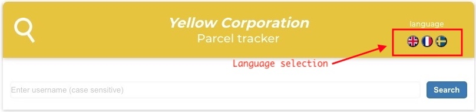
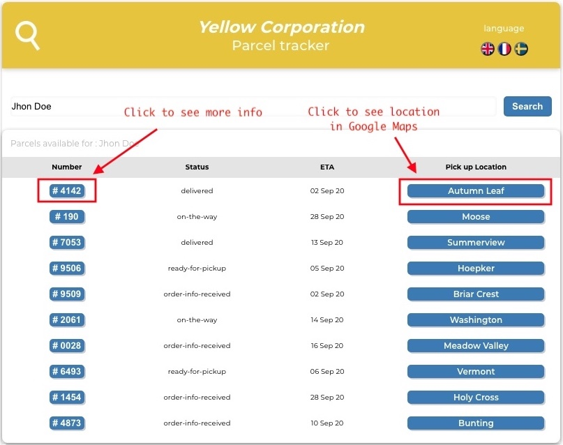

# Getting Started with Parcel Tracker App

This project was created with [Create React App](https://github.com/facebook/create-react-app).\
Link to the App : [Yellow Corporation Parcel Tracker App](https://package-tracking-app-6e0dd.web.app/)

### Use the app

#### Search a parcel
Enter a user_name ( case sensitive) to find more details about parcels associated to that user.
example : `Jhon Doe`

#### Change language
A basic implementation has been made by selecting the language on the header.
Languages implemented :

- English (default)
- French
- Swedish
**To go further** , it would be interesting to use that component : .[react-localization](https://www.npmjs.com/package/react-localization)
It uses the interface language to select the language that will be displayed to user.

### Screenshots

#### Home

#### Search results

### Getting started

In the project directory, you can run:

#### `npm start`

Runs the app in the development mode.\
Open [http://localhost:3000](http://localhost:3000) to view it in the browser.

The page will reload if you make edits.\
You will also see any lint errors in the console.

#### `npm test`

Launches the test runner in the interactive watch mode.\
See the section about [running tests](https://facebook.github.io/create-react-app/docs/running-tests) for more information.

#### `npm run build`

Builds the app for production to the `build` folder.\
It correctly bundles React in production mode and optimizes the build for the best performance.

The build is minified and the filenames include the hashes.\
Your app is ready to be deployed!

#### Deployment
##### General infos
See the section about [deployment](https://facebook.github.io/create-react-app/docs/deployment) for more information.

##### Using Firebase

Run following code in Terminal:\
`npm run build`\
`firebase deploy`

### Dependencies
#### Components
- [i18next](https://www.npmjs.com/package/i18next): Internationalization
- [moment](https://www.npmjs.com/package/react-moment) : Date formatting
- [@varld/popover](https://www.npmjs.com/package/@varld/popover) : Pop-over feature
